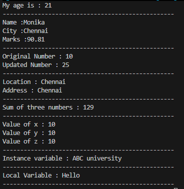

# Variables in Java

Variables are named memory locations used to store data. They allow us to store, access, and modify values during program execution.

---

## Syntax

```java
dataType variableName = value;
```

### Example

```java
int age = 21;
```

Here,

- `int` → Data type
- `age` → Variable name
- `21` → Value stored in the variable

---

## Why Do We Need Variables?

Variables help us store data and reuse it throughout the program instead of writing the same value multiple times.

Without variables:

```java
System.out.println(21);
System.out.println(21);
System.out.println(21);
```

Using a variable:

```java
int age = 21;

System.out.println(age);
System.out.println(age);
System.out.println(age);
```

If the value changes, you only need to update it in one place.

---

## Declaration and Initialization

### Declaration

Creating a variable.

```java
int age;
```

### Initialization

Assigning a value to the variable.

```java
age = 21;
```

### Declaration + Initialization

```java
int age = 21;
```

---

## Reassigning a Variable

The value stored in a variable can be changed.

```java
int marks = 75;

marks = 90;

System.out.println(marks);
```

**Output**

```
90
```

---

## Copying Variable Values

A variable's value can be assigned to another variable.

```java
int a = 10;
int b = a;

System.out.println(a);
System.out.println(b);
```

**Output**

```
10
10
```

Changing one variable later does not affect the other.

```java
a = 20;

System.out.println(a);
System.out.println(b);
```

**Output**

```
20
10
```

---

# Types of Variables

## 1. Local Variable

- Declared inside a method, constructor, or block.
- Accessible only within that method or block.
- Must be initialized before use.

```java
public static void main(String[] args) {
    int age = 21;
}
```

---

## 2. Instance Variable

- Declared inside a class but outside any method or constructor.
- Each object has its own copy.

```java
class Student {
    int age;
}
```

---

## 3. Static Variable (Class Variable)

- Declared using the `static` keyword.
- Shared among all objects of the class.

```java
class Student {
    static String college = "ABC College";
}

---

# Variable Naming Rules

✅ Valid

```java
age
studentName
first_name
salary123
$total
```

❌ Invalid

```java
1age
student-name
student name
class
```

### Rules

- Variable names cannot start with a number.
- Spaces and hyphens (`-`) are not allowed.
- Java keywords cannot be used as variable names.
- Variable names are case-sensitive.

---

# Best Practices

- Use meaningful variable names.
- Follow the camelCase naming convention.
- Keep variable names simple and descriptive.

**Good Examples**

```java
int studentAge = 21;
double accountBalance = 2500.75;
String firstName = "Monika";
```

---

# Examples

All examples related to variables are available in:

📄 **VariablesExample.java**

https://github.com/Monika752/Java-Guide/blob/main/core_java/02_Variables_in_Java/variablesExample.java

---

# Practice Questions

1. Declare a variable `age` and assign your age.
2. Create variables to store your name, city, and marks. 
3. Change the value of a variable and print the updated value.
4. Copy the value of one variable into another variable and print both values.
5. Create three integer variables and print their sum.
6. Initializing the same values of different variables in a single line

# Output



---

