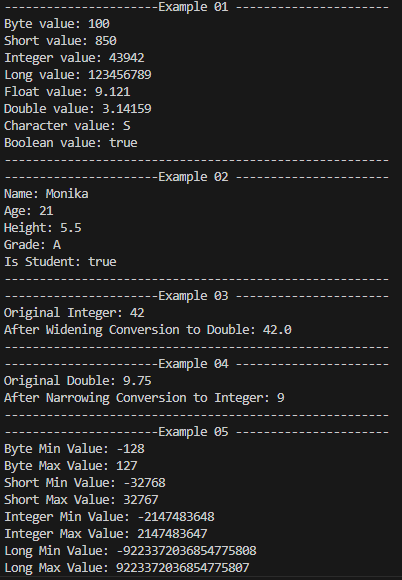

# Java Data Types

Data types define the kind of data a variable can store. Every variable in Java must have a data type, which determines the memory allocation and the operations that can be performed on it.

## Types of Data Types

Java data types are classified into two categories:

### 1. Primitive Data Types

Primitive data types are predefined by Java and store simple values.

| Data Type | Size | Description | Example |
|-----------|------|-------------|---------|
| `byte` | 1 byte | Small integer | `byte age = 20;` |
| `short` | 2 bytes | Integer | `short year = 2026;` |
| `int` | 4 bytes | Most commonly used integer | `int marks = 95;` |
| `long` | 8 bytes | Large integer | `long population = 8000000000L;` |
| `float` | 4 bytes | Decimal number | `float price = 99.99f;` |
| `double` | 8 bytes | Decimal number (more precise) | `double salary = 45000.75;` |
| `char` | 2 bytes | Single character | `char grade = 'A';` |
| `boolean` | JVM dependent | `true` or `false` | `boolean isPassed = true;` |

---

### 2. Non-Primitive Data Types

Non-primitive data types store references to objects.

Examples include:

- `String`
- Arrays
- Classes
- Interfaces
- Objects
- Enums

```java
String name = "Monika";
int[] numbers = {1, 2, 3};
```

---

## Choosing the Right Data Type

| Requirement | Recommended Data Type |
|--------------|----------------------|
| Age | `int` |
| Population | `long` |
| Price | `double` |
| Grade | `char` |
| Yes/No | `boolean` |
| Name | `String` |

---

## Type Conversion

### Widening (Implicit Conversion)

A smaller data type is automatically converted into a larger data type.

```java
int number = 100;
double value = number;

System.out.println(value);
```

**Output**

```
100.0
```

---

### Narrowing (Explicit Conversion)

A larger data type is manually converted into a smaller data type using type casting.

```java
double number = 99.99;
int value = (int) number;

System.out.println(value);
```

**Output**

```
99
```

---

## Common Mistakes

❌ Forgetting `L` for `long`

```java
long value = 8000000000;
```

✔ Correct

```java
long value = 8000000000L;
```

---

❌ Forgetting `f` for `float`

```java
float pi = 3.14;
```

✔ Correct

```java
float pi = 3.14f;
```

---

❌ Using double quotes for `char`

```java
char grade = "A";
```

✔ Correct

```java
char grade = 'A';
```

---

❌ Using single quotes for `String`

```java
String name = 'Monika';
```

✔ Correct

```java
String name = "Monika";
```

---

## Memory Trick

```
Whole Numbers
--------------
byte
short
int
long

Decimals
---------
float
double

Character
---------
char

True / False
------------
boolean
```

---

## Example Program

A complete example covering:

- All primitive data types
- Personal details using appropriate data types (Name, age, height, grade)
- Widening conversion
- Narrowing conversion
- Minimum and maximum values of integer data types using MIN_VALUE and MAX_VALUE

📄 **Example Source Code**

[DataTypesExample.java](https://github.com/Monika752/Java-Guide/blob/main/core-java/03_Datatypes/datatypesExample.java)

# sample output



---

## Key Takeaways

- Every variable must have a data type.
- Java has **8 primitive data types**.
- Use `int` for most whole numbers.
- Use `double` for decimal values.
- Use `char` for a single character.
- Use `boolean` for `true` or `false`.
- Widening conversion happens automatically.
- Narrowing conversion requires explicit casting.